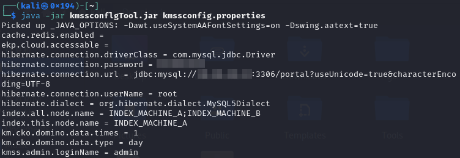

# kmssconflgTool

蓝凌OA数据库配置文件(kmssconfig.properties)解密工具
加密算法: DES-ECB
默认密钥: kmssPropertiesKey

- 数据库配置文件位置

  `/WEB-INF/KmssConfig/kmssconfig.properties`

- 使用方式

  `java -jar kmssconflgTool.jar kmssconfig.properties`
  
  
